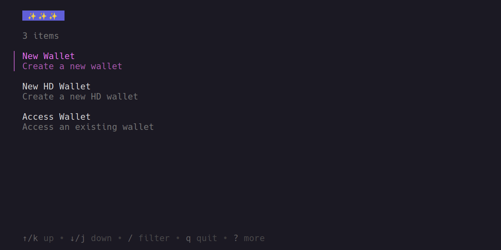
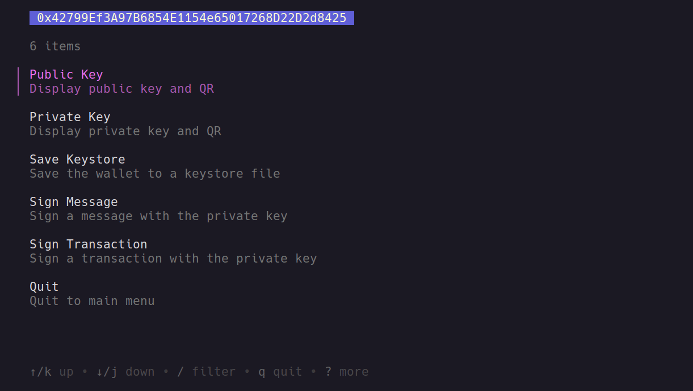

# ETH Wallet Toolkit

CLI toolkit to easily create & manage Ethereum wallets, written in Go.

The project is still a work in progress, but the basic features are complete. It's designed to be easy to use, and as simple as possible.

## Installation

Download the latest release from the [releases page](https://github.com/trizin/eth-wallet-toolkit/releases).

## Build

```bash
$ git clone https://github.com/trizin/eth-wallet-toolkit.git
$ go build .
```

## Features

- Create a new Ethereum wallet.
- Save wallet as a keystore file.
- Load an existing wallet from a private key/keystore file.
- Create & manage HD wallets.
- Sign messages.
- Sign and send transactions.
- Query chain data.
  - Get account balance.
  - Get tx info by hash.
  - Get block info by number.

## Usage

To access chain data, you need to specify an RPC endpoint. You can do it by pressing "ctrl+p" in the wallet management menu and entering the URL.

### Wallet Management


  


### Wallet Access


  


### Sending Transactions



